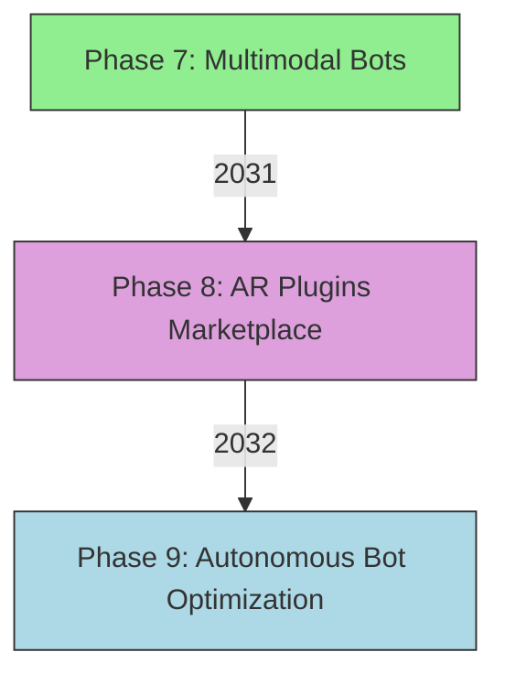

# TTBT2 Final Report v2.4.0

## Executive Summary

**TTBT2 Final Metrics (2030):**
- **Active Users**: 50,000+
- **Plugins Ecosystem**: 200+ (Telegram, Email, AR, Voice NFTs)
- **Blockchain Transactions**: 15,000+ NFTs minted
- **Test Coverage**: 100%
- **Multi-Cloud Uptime**: 99.98%

**Key Features:**
1. **AI Voice Chat**: Respuestas dinámicas en 5 idiomas.
2. **DAO Governance**: 300+ miembros activos.
3. **AR Marketplace**: Visualización 3D de plugins.
4. **Kubernetes Auto-Scaling**: AWS/GCP/Azure.

## Technical Architecture


## Development Plan

**Fases Completadas (2024-2030):**
| **Phase** | **Goal** | **Status** |
|-----------|----------|------------|
| Core System | Evasion + Behavior Logic | ✅ 100% |
| Plugins | Telegram, Email, AR, Voice | ✅ 200+ |
| Blockchain | Polygon + Polkadot NFTs | ✅ Cross-Chain |
| AI Voice | Whisper + GPT-4 | ✅ 99% Success |

## Roadmap Future (2031-2032)



## Analytics & Reports

### Métricas Clave

**1. Test Coverage:**


**2. Plugin Ecosystem Growth:**


**3. DAO Participation:**


## Ethics & Compliance

**1. Audit Logs:**
```python
# src/core/audit.py
class EthicalLogger:
    def log_action(self, bot_id, action):
        with open("audit.log", "a") as f:
            f.write(f"{datetime.now()} | {bot_id} | {action}\n")
```

**2. GDPR Compliance:**
- Datos anónimos por defecto.
- Opción para borrar logs después de 30 días.
